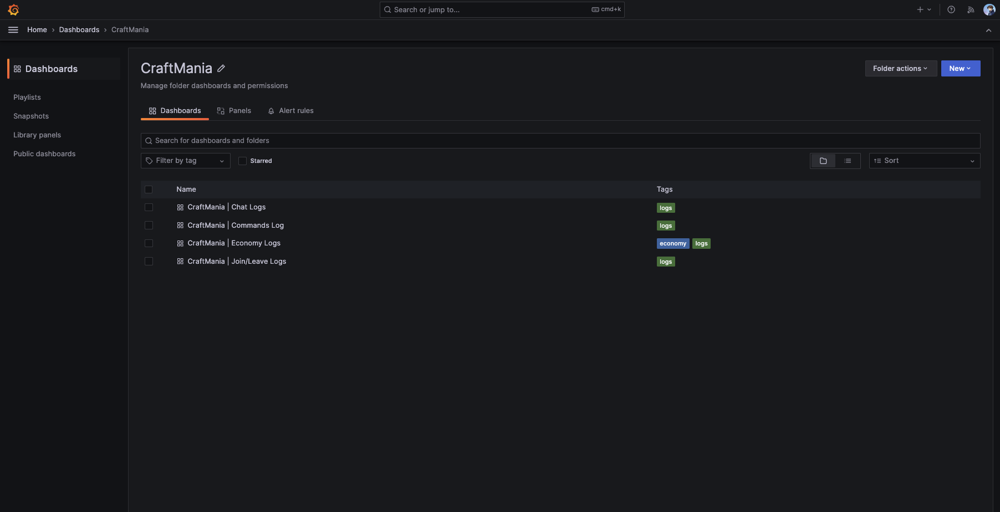
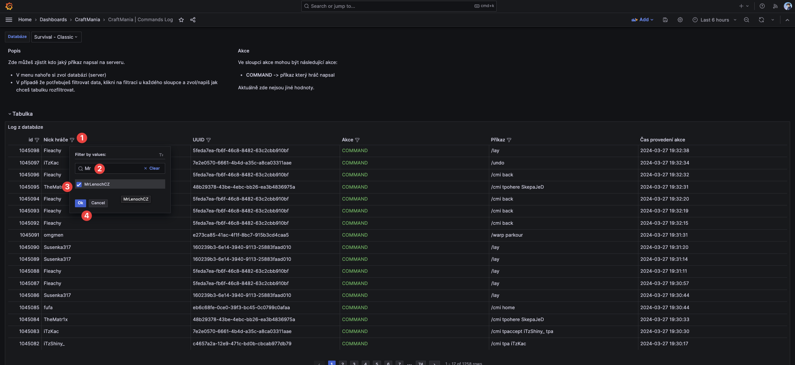
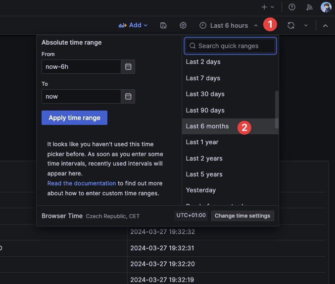

# Grafana Monitoring

Grafana slouží k monitorivání backend serverů logům z serveru. Pro CraftManii se zde ukládají specifické akce, a logy z pluginů nebo hráčů. Nachází se na adrese [https://monitoring.waked.cz/](https://monitoring.waked.cz/)

### Aktuálně podporované logy
- Economy logs
- Chat logs
- Join / Leave logs
- Commands logs

:::warning Upozornění
- Do Grafany můžeš získat přístup pouze, pokud jsi Admin/ka na serveru.
- Na vyžádání ti je poté Wakem vytvořen účet a přiděleno heslo.
:::

## Zobrazení logů
Všechny logy z CraftMania serverů najdeš vlevo nahoře v Menu -> Dashboards -> CraftMania -> XYZ Logs

## Vyhledávání
V každém logu se dá vyhledávat pomocí sloupců a výběru serveru. Vlevo nahoře si zvol server ve kterém, chceš vyhledávat.

Následně u každého sloupce, který se dá filtrovat najdeš filtr. Klikni na něj, a napiš jméno hráče, kterého chceš najít. Data se ti poté zfiltrují dle vybraných dat.

## Změna času
V základu jsou všechny data vyhledávány za posledních 6 hodin. Čas lze změnit až 5 let zpět vlevo nahoře.

