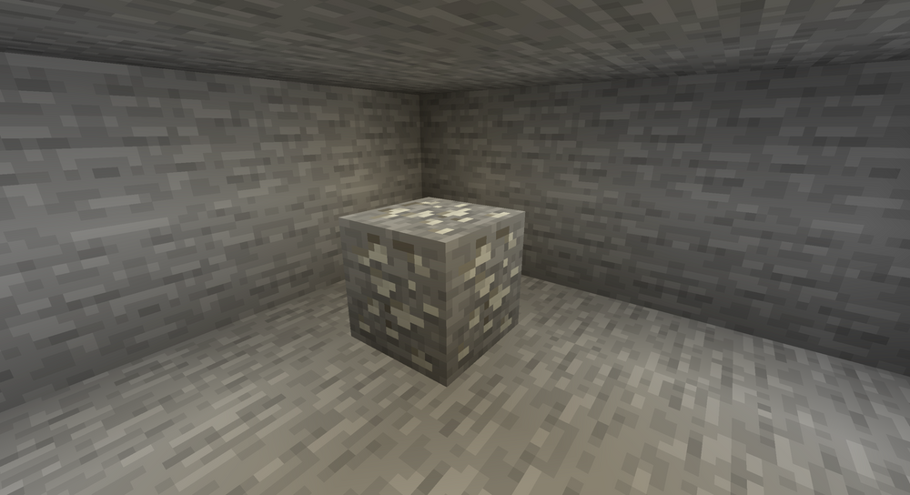
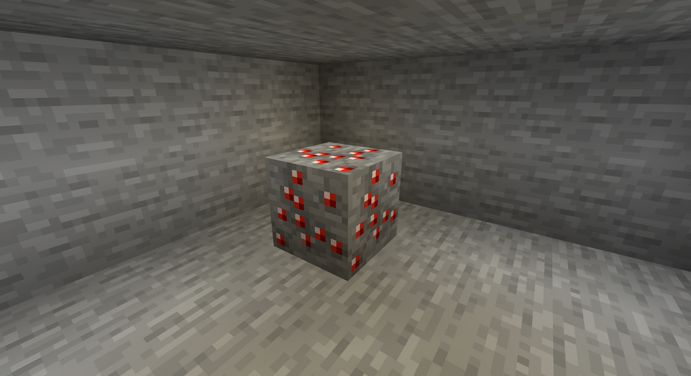
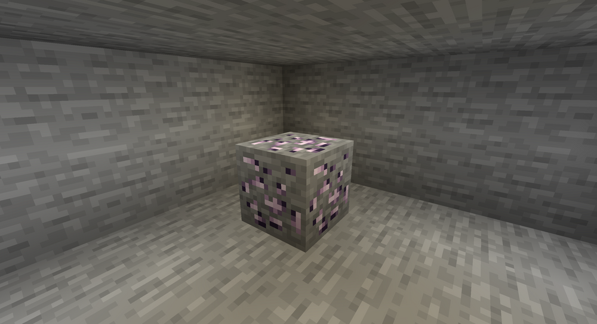
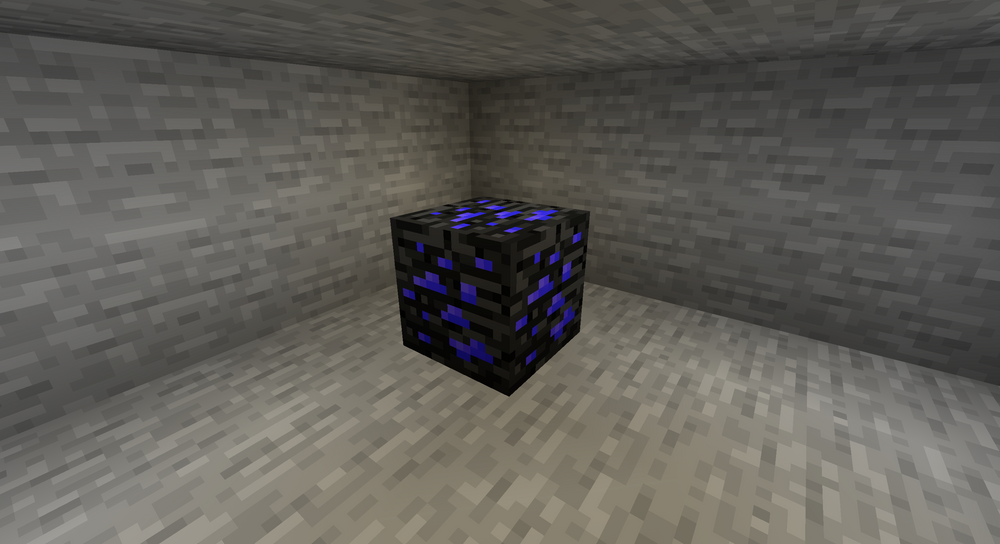

# Generace ore

Od verze 1.18 se na některých serverech nachází naše vlastní ore, které v základním Minecraftu nejsou. Toto téma obsahuje všechny informace, kde se tyto Ore nachází a k čemu slouží.

- Zinc Ore (Zinek)
- Ruby Ore (Rubín)
- Platinum (Platina - nemá Ore variantu)
- Lead Ore
- Unknown Ore (Wake's Ore)

:::info Recepty
Recepty, co lze craftit z zde uvedených ore lze zobrazit v knize receptů - `/kit recipes`.
:::

:::warning Dostupnost
Ore se aktuálně negenerují na žádném Survival serveru. Pro Oneblock server, se dají ore vycraftit pomocí speciálních receptů.
:::

## Zinc Ore
Zinek je základní pokročilý material, který se generuje v normálním světě. Slouží primárně k receptům na Furnitures (nábytek) nebo pokročilejší recepty s Platinum.

### Vlastnosti a generace
| Typ | Hodnota |
| --- | --- |
| Material varianty | Ingot + Dust |
| Zbraně a brnění | Ano - lze vycraftit |
| Lze vytěžit s | Diamond, Ruby, Zinc, Platinum, Netherite Pickaxe |
| Svět kde se generuje | Normální - world |
| Šance na vygenerování | 70% |
| Výška generace | 30 až 45 bloků |
| Žíla (počet bloků u sebe) | Max 3 bloky |
| Maximum bloků na chunk | 10ks |
| Šance na drop itemu | 100% |
| Počet drop itemů | 1-2ks Zinc Dust | 
| Ignoruje enchant Fortune | Ne |
| Ignoruje TNT damage | Ne, zníčí se, nedropne nic |
| Počet expů z vytěžení | 4 až 20 exp |

## Ruby Ore
Rubín je vzácnější ore, taková hodně lepší varianta Netheritu a Diamantu v jednom. Rubín brnění je totiž jedno z nejsilnějších na serveru (bez enchantů) má totiž až 2x větší výdrž oproti Netheritu.

### Vlastnosti a generace
| Typ | Hodnota |
| --- | --- |
| Material varianty | Crystal + Shard |
| Zbraně a brnění | Ano - lze vycraftit |
| Lze vytěžit s | Zinc, Platinum, Ruby, Netherite Pickaxe |
| Svět kde se generuje | Normální - world |
| Šance na vygenerování | 50% |
| Výška generace | 0 až 5 bloků |
| Žíla (počet bloků u sebe) | 1 blok |
| Maximum bloků na chunk | 3ks |
| Šance na drop itemu | 75% |
| Počet drop itemů | 1x Ruby Crystal |
| Ignoruje enchant Fortune | Ano |
| Ignoruje TNT damage | Ne, zníčí se, nedropne nic |
| Počet expů z vytěžení | 8-25 exp |

### Ruby Armor & Items
- Ruby Armor je speciální v tom, že když máš celý set - Helmet, Chestplate, Leggings a Boots nasazený, tak máš zvýšené HP o 5 HP (3-4 strdíčka), dohromady s full setem budeš mít 25 HP.
- Ruby Pickaxe je speciální v tom, že jako jediný krumpáč má na sobě při vytvoření již Vein enchant, který se nedá získat nijak jinak. Vein enchant je enchant se kterým máš šanci na vytěžení celé žíly ore.

## Platinum
Platina je pokročilý material skládající se z Iron Ingoru, Zinc Ingotu a Netherite Ingotu. Platinum nemá ore a negeneruje se ve světě, lze jej pouze vycraftit.

Tento material slouží k craftingu pokročilých itemů, armorů nebo nástrojů.

:::info
Recept na crafting platinum ingotu lze zobrazit v Recipe Book - `/kit recipes`.
:::

### Vlastnosti a generace
| Typ | Hodnota |
| --- | --- |
| Material varianty | Ingot |
| Zbraně a brnění | Ano - lze vycraftit |

### Platinum Items
Platinové itemy jako sword, pickaxe a jiné mají nejvyšší základní durabilitu - 3000 bodů.

## Lead Ore
Lead je pokročilý material, který slouží k craftění nábytku, stats trackeru a jiných itemů pro end game obsah.

### Vlastnosti a generace
| Typ | Hodnota |
| --- | --- |
| Material varianty | Dust + Ingot | 
| Zbraně a brnění | Ne, nemá armor | 
| Lze vytěžit s | Netherite, Ruby, Zinc Pickaxe | 
| Svět kde se generuje | Normální - world | 
| Šance na vygenerování| 40% | 
| Výška generace | -20 až -30 bloků | 
| Žíla (počet bloků u sebe) | 1 blok | 
| Maximum bloků na chunk | 4ks | 
| Šance na drop itemu | 100% | 
| Počet drop itemů | 1x Lead Dust |
| Ignoruje enchant Fortune | Ano | 
| Ignoruje TNT damage | Ne, zníčí se, nedropne nic | 
| Počet expů z vytěžení | 6-25 exp |

## Unknown Ore
Neznámé ore, někdy nazývané i jako Wake's Ore je extremně vzácný Ore, které se generuje opravdu jenom zřídka. Slouží k craftění end game itemů, nejlepšího armoru, figurek členů AT a nástrojům, které mají funkcionalitu.

### Vlastnosti a generace
| Typ | Hodnota |
| --- | --- |
| Material varianty | Dust + Shard | 
| Zbraně a brnění | Ano má armor | 
| Lze vytěžit s | Platinum, Ruby Pickaxe | 
| Svět kde se generuje | Normální - world | 
| Šance na vygenerování | 35% | 
| Výška generace | -59 až -64 bloků | 
| Žíla (počet bloků u sebe) | 1 blok | 
| Maximum bloků na chunk | 1ks | 
| Šance na drop itemu | 100% | 
| Počet drop itemů | 1x Unknown Dust | 
| Ignoruje enchant Fortune | Ano | 
| Ignoruje TNT damage | Ne, zníčí se, nedropne nic | 
| Počet expů z vytěžení | 25-50 exp | 

