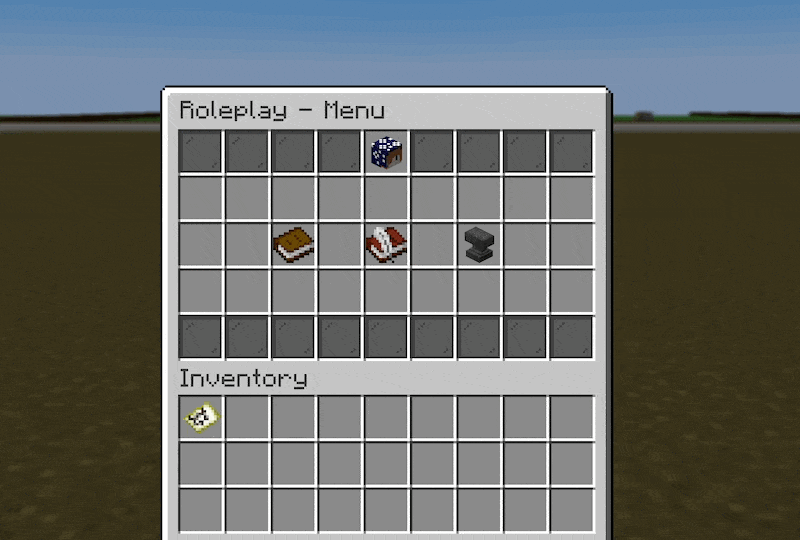
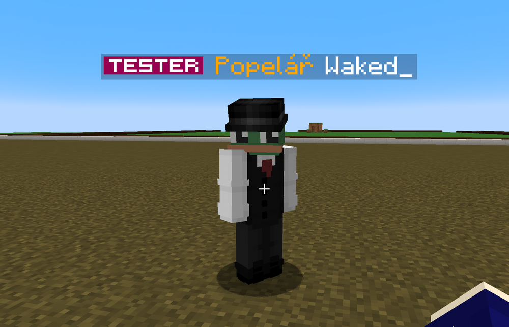
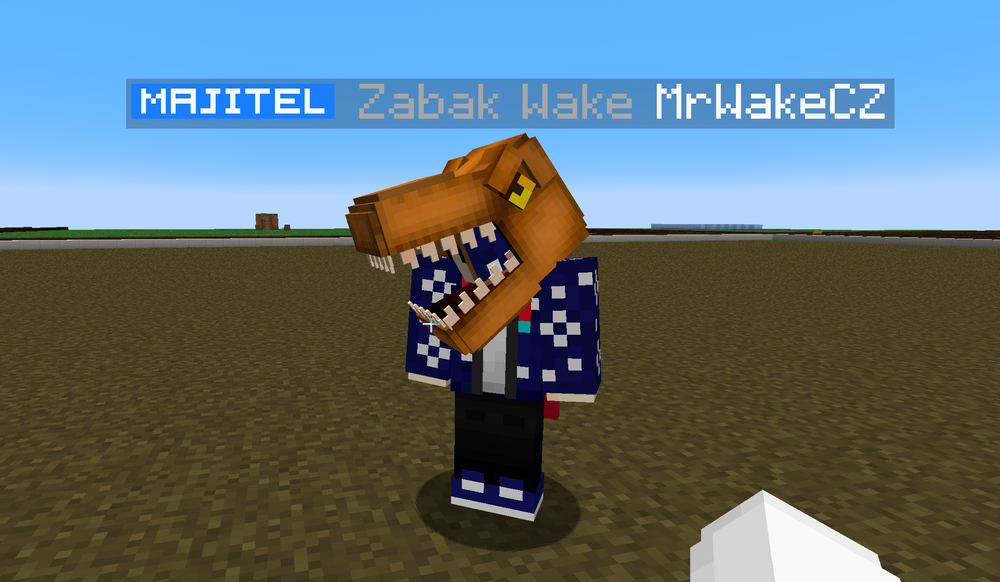

# Creative Roleplay
Na Creativu na každém pozemku si každý může **vytvořit vlastní roleplay roli**, která se zobrazí v chatu a nad nickem. Tento návod popisuje jak ovládat roleplay plugin a jak spravovat své role.

:::info
Roleplay plugin je aktuálně nedostupný z důvodu rozbití na verzi 1.20.
:::

## Základní příkaz
Přístup k roleplayi má každý hráč bez ohledu zda je VIP nebo, včetně barev a vše neomezeně. Základní příkaz je `/rp` nebo `/roleplay`.

## Předdefinované role
Aby byl svět jednoduší, nadefinovali jsme pár základních roleplayů - škola, práce a zvířátka. Není proto nic jednoduššího než zajít do `/rp` zvolit "Předdefinované role" a vybrat si tu svou.

## Vlastní role
Co by to bylo za roleplay, kdyby jste si nemohli vytvořit vlastní roli? Jep i to nabízí roleplay plugin. Každý si může libovolně nastavit jakou roli chce.

- Vlastní role je vázána jako klasická role na konkrétní pozemek
- Nesmí obsahovat sprostá slova
- Vlastní role může může obsahovat až 16 znaků (s mezerami)

Jednoduše stačí opět napsat `/rp` a v menu vybrat "Vlastní role". Poté stačí v chatu kliknout na zprávu nebo napsat `/rp customrole [text]`. A nakonec vše potvrdit kliknutím v chatu, a role je vytvořena.

:::info Vlastní barva role
Doporučujeme přidat před název role barvu, jinak se použije barva z role.
Př. `/rp customrole &7Zabak Wake`
:::

## Správa rolí
Rolí lze mít neomezeně, prakticky na každý pozemek na Creativu. Proto je zde i management, kde můžeš role z jiných pozemků (tvých) mazat. Vše pomocí prostředního itemu v `/rp` menu.

:::caution Zobrazení rolí
Role se v chatu a nad hlavou zobrazuje pouze, pokud jsi na pozemku, pro který jsi si vytvořil/přiřadil roli.
:::

