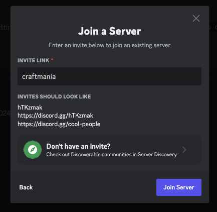
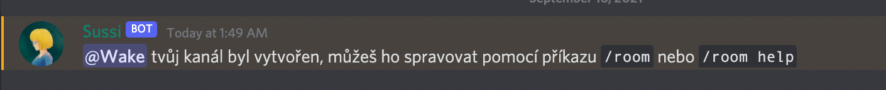
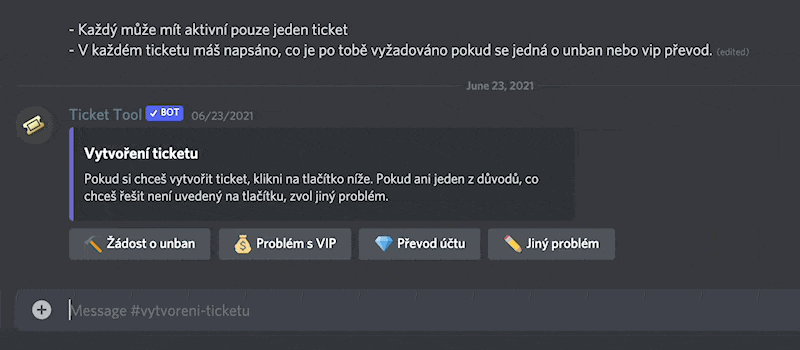
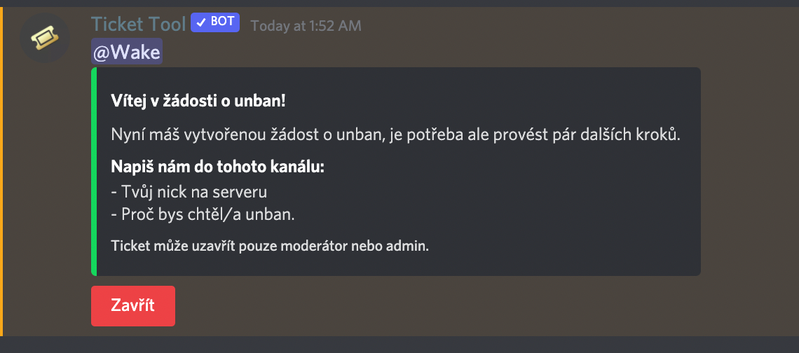
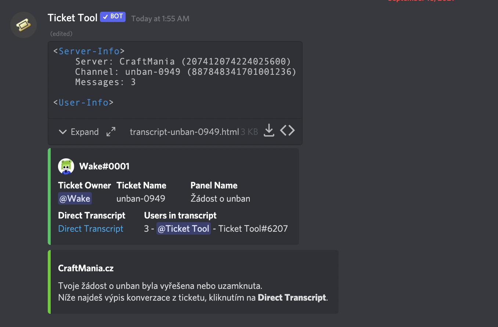

# Discord

Discord na našem serveru slouží jako hlavní stránka přes řešení problémů. Řeší se zde vše. Můžeš zde nahlašovat hráče, nechat si poradit s problémem nebo bugem, požádat si o unban, nebo si třeba jen pokecat s naší komunitou.

## Jak se připojit?
Náš discord server má vlastní zvací odkaz, přes který se může připojit každý [discord.gg/craftmania](https://discord.gg/craftmania). Nebo stačí do odkazu na přidání serveru v Discordu napsat `craftmania`.

:::danger Varování
Abys mohl psát na našem Discord serveru je potřeba mít ověřený účet pomocí mailu, existující účet více jak 10 minut a také mít ověřené číslo, bez těchto věcí ti nepůjde psát do chatu.
:::

## Vlastní hlasový kanál
Pokud chceš u nás s někým o něčem pokecat, není lepší než si vyvořit vlastní hlasový kanál. Lze to udělat tak, že se připojíš do kanálu **Vytvořit voice kanál**. Náš server bot (Sussi) ti poté vytvoří vlastní hlasový kanál, který můžeš ovládat pomocí příkazů.

- `/room lock` - Uzavře tvůj kanál
- `/room unlock` - Odemkne voice kanál
- `/room add [@uživatel]` - Přidá člena do uzamknutého kanálu
- `/room remove [@uživatel]` - Odebrání uživatele z kanálu
- `/room name [název]` - Nastaví jméno tvého kanálu
- `/room limit [číslo]` - Nastaví limit hráčů ve voice
- `/room unlimited` - Nastaví neomezený počet připojených uživatelů
- `/room ban [@uživatel]` - Zabanuje uživateli přístup a viditelnost tvého kanálu
- `/room bitrate [číslo v kbps]` - Nastaví kvalitu hovoru

## Tickety

Přes tickety se řeší bany, převod nebo problém VIP, stížnosti na člena adminteamu a další.

### Jak ticket založit?
Ticket založíš kliknutím na tlačítko u zprávy, která odpovídá tvým požadavkům. V tomto případě si chci zažádat o unban, tak kliknu na tlačítko **Žádost o unban** (viz. obrázek)

Jakmile kliknu na tlačítko, tak se mi pod kanálem **#vytvoreni-ticketu** objeví kanál, který se bude jmenovat **unban-0455**(v tvém případě tam bude jiné číslo) a dostanu instrukce co napsat.

Poté budu řešit unban s tím, kdo mi ho udělil. Jakmile bude ticket vyřešený, tak zažádáš nějakého admina nebo moderátora, aby ticket uzavřel. Bot ti pošle do soukromých zpráv zprávu o uzavření ticketu a kanál se smaže. (viz. obrázek).

:::tip
Ticket si můžeš znovu přečíst kliknutím na Direct transcript.
:::
