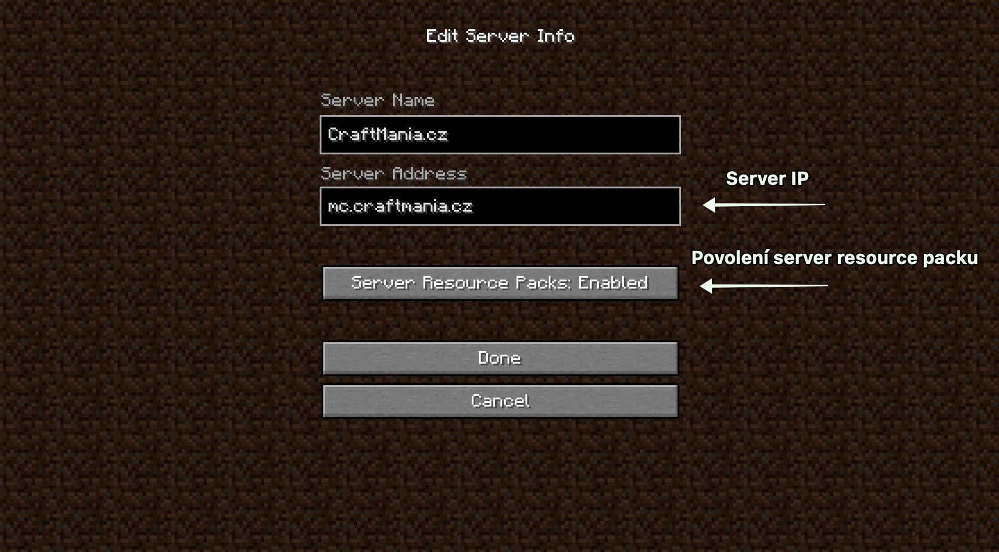
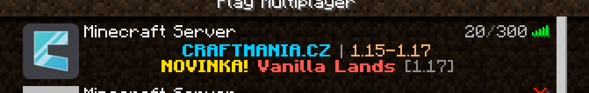

# Připojení na server

Zde se dozvíš, jak se jednoduše připojit na server, jaké verze podporujeme a co je potřeba mít zapnuto.

## Připojení

Náš server funguje vždy na nejnovější verzi Minecraftu. K dnešnímu dni to je 1.18.x až 1.20.4. Výrazně ale doporučujeme používat minimálně verzi 1.20.2!

## IP Adresa
K připojení na PC verzi našeho serveru potřebuješ jednu z následujících IP:

- `mc.craftmania.cz` - Oficiální IP -> vždy funguje!
- `play.craftmania.cz` - Starý formát používaný v minulých letech, avšak stále funguje.

Pokud jsi zadal/a IP správně, Minecraft pingne náš server a ty uvidíš popisky našeho serveru. Poté se stačí již jenom připojit. 😃

