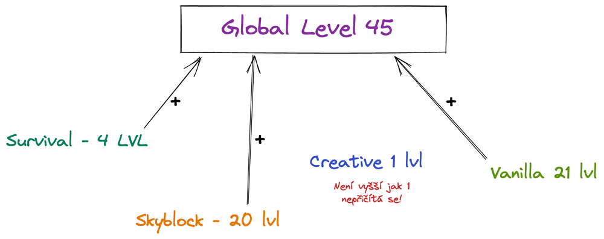

# Server ekonomika
Většina serverů má svojí ekonomiku např. Survival a Skyblock, ty mají hodnotnou ekonomiku vždy označenou jako **$** (dolar). Ovšem na serveru se nachází i globální ekonomika, tedy měna za kterou lze kupovat různé odměny, cosmetics a výhody.

## Naše měna

Jedna z největších globálních ekonomik se jmenuje CraftCoin `/cc` nebo-li `/craftcoins`, je to měna za kterou si lze pomocí tzv. CoinShopu zakoupit věci na serveru.

- `/cshop` - Otevření CoinShopu
- `/cc` - Zobrazení aktuálního počtu CraftCoins

CraftCoiny se dají získávat hraním (aktuálně převážně hlasováním), plněním questů nebo jako denní odměna na lobby (dáreček na pravé straně).

Na serveru se nachází ještě více ekonomik, zde je jednoduchý výpis:
- **CraftCoins** `/cc` - Ekonomika na bonusy a cosmetické věci.
- **CraftTokens** `/ct` - Reálná měna převzatá dle eura (1 CT = 1 Euro). Za CraftToken si lze třeba zakoupit vlastní tag před jméno.
- **VoteTokens** `/vt` - Je měna za hlasování (1 hlas = 1 VT). Za VoteToken si můžeš koupit stejně jako u CraftCoinu bonusy na servery v `/cshop`.
- **EventPoints** `/ep` - Lze získat na našem Event Serveru, kde se každý den pořádají eventy. Za EventPoint si lze zakoupit CraftCoins nebo limitované cosmetics.
- **QuestPoints** - Body za splnění questů. Nedají se bohužel nijak jinak využít.
- **Karma** - Body za dobré chování na serveru. Udělují jej hráči u nás na Discord serveru pomocí příkazu `/rep`.

## Level systém
Na každém serveru na CraftManii najdeš individuální server rank systém. Rank systém se skládá z levelů, kterými si odemykáš odměny a lepší výhody. Součtem všech server levelů se ti tvoří celkový globální level.

- `/level` - Zobrazí globální server level s ostaními servery
- `/level survival` - Zobrazí server level pro Survival server
- `/level [server]` - Zobrazí level pro specifický server

### Globální level
Součtem server levelů hráč získává celkový tzv. globalní level. Každý level vyšší jak 1 se počítá. Jak je vysvětleno níže na obrázku:

### Server level

Každý server má svoje level odměny a tedy i svoje expy/levely. Tyto server levely se nijak nedají převádět a jsou přímo děleny podle serverů.

Každý hráč během hraní na serveru (kromě lobby a hubů) získává pro daný server náhodný počet expů. Hodnoty se liší podle obtížnosti serveru a počtu questů a jiných odměn, které se započítávají do levelu.

| Server | Počet expů | Za čas |
| ------ | ------ | ------ |
| Survival |	150-400 |	5 minut |
| Skyblock |	150-400 |	5 minut |
| Creative |	100-300 |	5 minut |

### Jak získám expy/levely?

Expy na levely se dají získat mnoha způsoby, například:

- Plněním questů
- Hraním na serveru (nebýt AFK)
- Hlasováním
- Hádání random hádanek v chatu