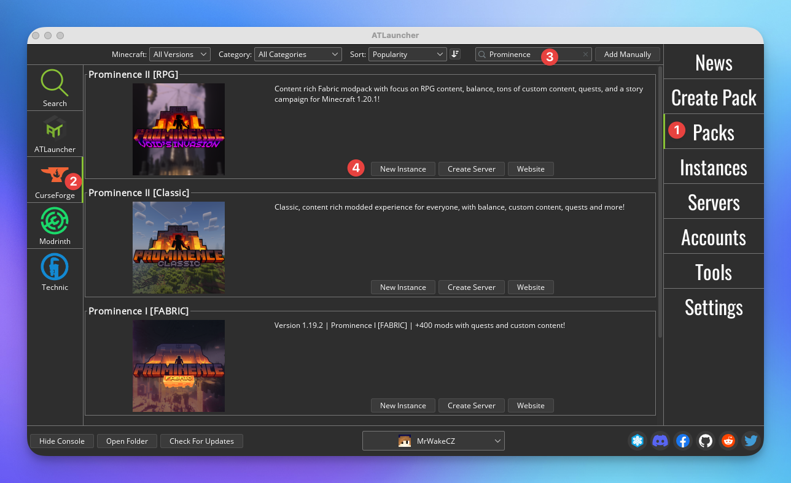
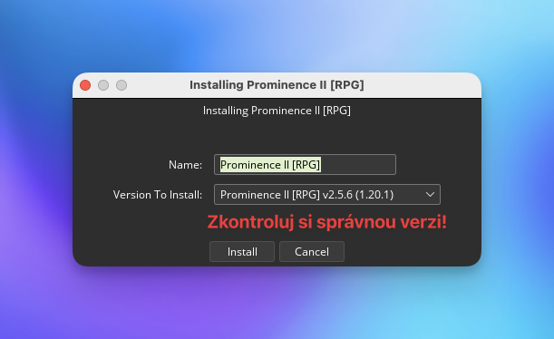
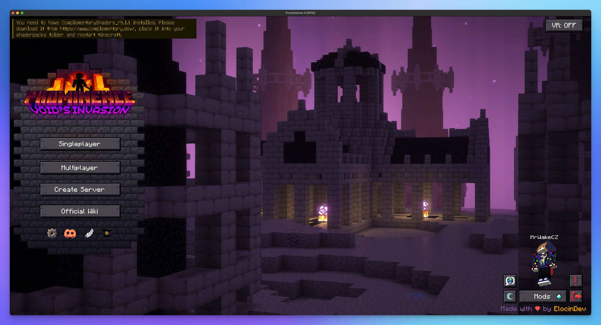
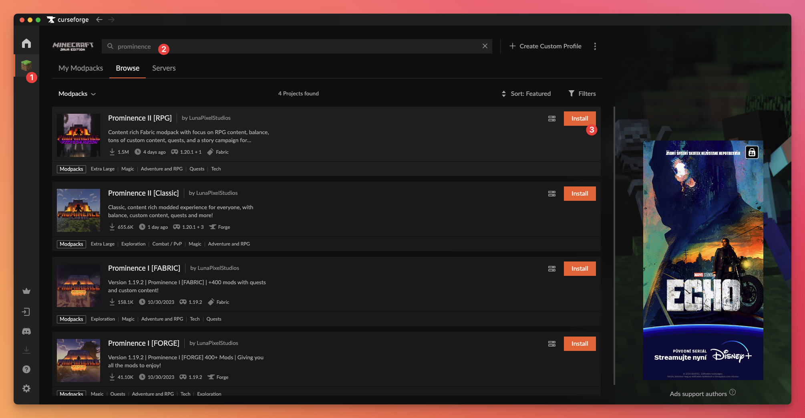
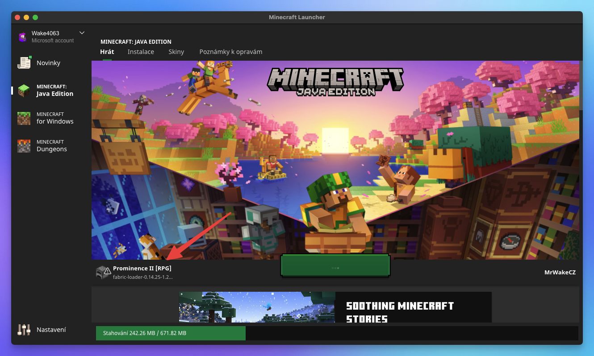
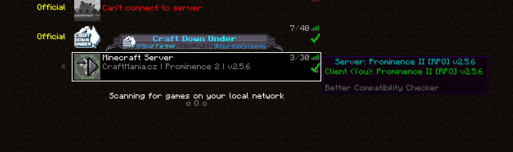

# Jak se připojit

Předtím než se připojíš na server, je potřeba **vlastnit originální Minecraft účet**. Modované servery na CraftManii nepodporují a nebudou podporovat warez Minecraft připojení.

:::info Aktuální verze
Minecraft verze serveru je: `1.20.1` a modpack verze: `2.7.0`
:::

## ATLauncher
1. Stáhni si a nainstaluj si [ATLauncher](https://atlauncher.com/downloads)
2. Přihlaš se do svého originálního Minecraft účtu v záložce **Accounts**
3. Klikni na **Packs**, poté **CurseForge**, a stáhni si modpack [Prominence 2 RPG Void Invasion](https://www.curseforge.com/minecraft/modpacks/prominence-2-rpg) na kliknutí **New instance**.

4. ATLauncher se tě zeptá jakou verzi nainstalovat, vyber příslušnou verzi uvedenou výše a klikni na **Install**.

:::warning Chybějící mody
- Pokud stahuješ modpack z záložky CurseForge, některé mody nejdou stáhnout napřímo z CurseForge, proto ATLauncher stahuje mody z jiných zdrojů. 
    - Pokud se ti ATLauncher zeptá, zda chceš stáhnout dodatečné mody, klikni na **Open** a stáhni mod. O vše další se postará sám ATLauncher.
- Stahování modpacku z Modrinthu není doporučeno jelikož neobsahuje FTB mody, které jsou potřeba pro hraní na serveru a musí být staženy individuálně.
:::

5. Po dokončení instalace klikni na **Instances** a poté na **Play**.

:::tip Přidání RAM
Doporučujeme přidat modpacku více RAM, aspoň 6GB pro hladký průběh. RAM přidáš v záložce **Settings** a poté **Java/Minecraft** změníš **Maximum Memory/RAM** na hodnotu `6144`.

Nezapomeň níže kliknout na **Save**.
:::

6. Pokud ti najel Minecraft v pořádku a vidíš úvodní obrazovku znázorněnou níže, nyní se můžeš připojit na náš server. Klikni na **Multiplayer** a poté **Add Server**.

Zadej IP adresu našeho serveru jako: `pro.craftmania.cz:28000` a klikni na **Done**.

## CurseForge
1. Stáhni si a nainstaluj si [CurseForge](https://www.curseforge.com/download/app)
    - Pokud máš CurseForge již nainstalovaný, přeskoč na krok 3.
2. Po nainstalování vyber **Minecraft**, **Standard** a poté **Browse Modpacks**.
3. Klikni na Minecraft, do vyhledávání výše napiš `Prominence` a klikni na instalaci u modpacku (je to ten s Void Invasion).

4. Po dokončení instalace najdeš modpack v záložce **My Modpacks**. Ujisti se, že máš správnou verzi uvedenou výše pomocí **...** a **Change version**.
5. Pokud chceš změnit množství RAM, klikni na **...** a poté **Profile Options**. Zde můžeš změnit množství RAM, naše doporučení je 6GB (6144MB) minimálně.
6. Poté již stačí kliknout na **Play**.
7. Spustí se ti Minecraft client, kde bude potřeba se přihlásit s Microsoft učtem. Poté normálně spustit Minecraft ve spuštěním clientovi.

:::warning Pomalejší načítání clienta
Někdy to chvilku trvá, než se spustí Minecraft sám, doporučujeme tedy počkat chvilku a neklikat na nic.
:::

6. Pokud ti najel Minecraft v pořádku a vidíš úvodní obrazovku znázorněnou výše, nyní se můžeš připojit na náš server. Klikni na **Multiplayer** a poté **Add Server**.

Zadej IP adresu našeho serveru jako: `pro.craftmania.cz:28000` a klikni na **Done**.

## Kontrola správné verze
Předtím než se připojíš na server, tak najetím na fajfku vedle Minecraft serveru se ti zobrazí zda máš správnou verzi jako náš server.

