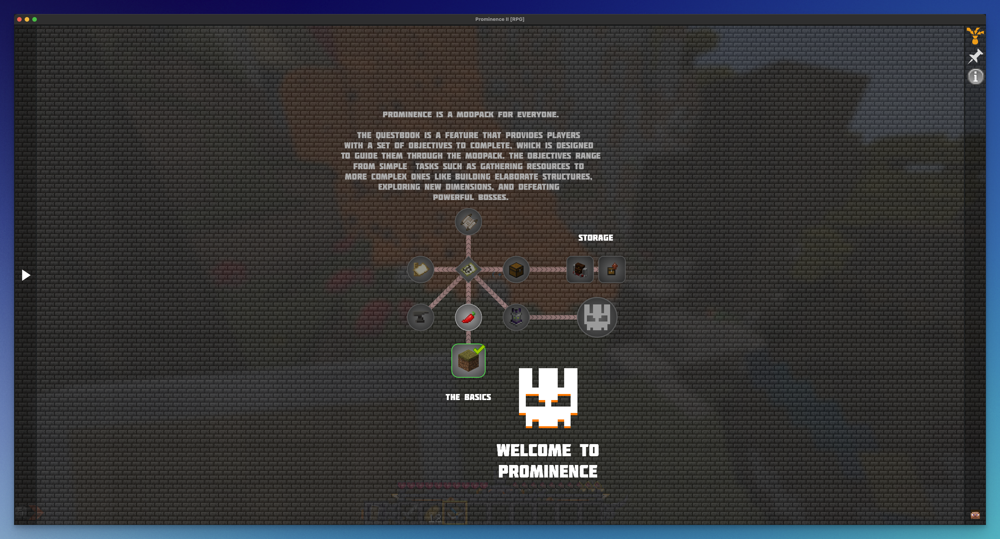
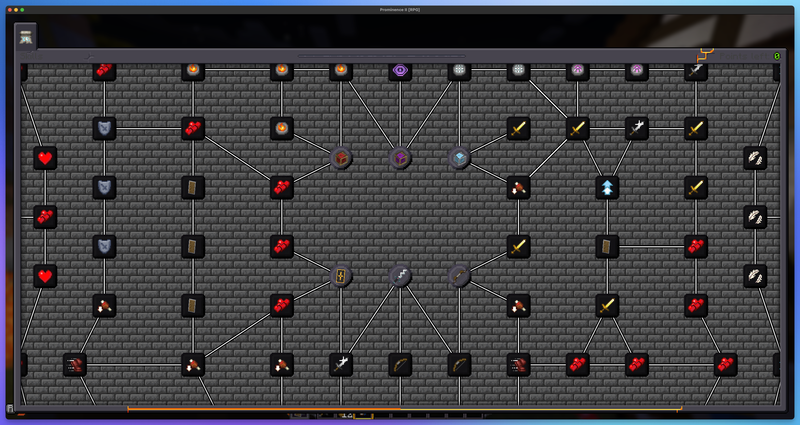
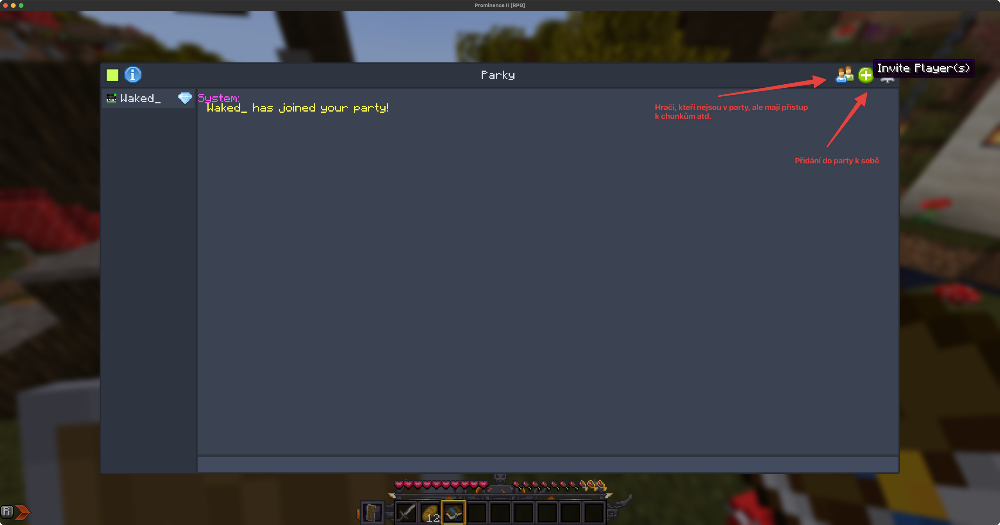

# Zaklady hraní

Po prvním připojení najdeš v inventáři meč (Stone), chleba (12ks), shield a quest book. Zde již začíná tvá cesta po světě Prominence 2.

:::tip
Svět není nijak omezený (zatím), můžeš jít tak daleko jak to Minecraft umožní.
:::

## Základní klávesy
| Klávesa | Popis | Klávesa | Popis |
| ------ | ------ | ------ | ------ |
| (R) | Dash | (U/B) | Přidání waypointu |
| (P) | Nastavení shaderu | (M) | Zobrazení mapy |
| (C) | Optifine zoom | (K) | Talent tree |
| (§) | Nastavení ochrany chunků | - | - |

## Questy
Po připojení jsi dostal do inventáře Quest book, se kterou si můžeš zobrazit questy. Najdeš je také vlevo nahoře v inventáři (E) -> Quests.

Po otevření questů se ti zobrazí **Getting started**. Jsou to základní questy, které tě provedou začátky modpacku. Doporučujeme všem je splnit!

## Talenty
Ve hře se nachází talenty, se kterými si můžeš upravit svůj "playstyle". Stisknutím klávesy (N) se ti zobrazí celý talentový strom, kde si můžeš vybrat, který talent chceš získat.

:::warning Pozor
Ve verzi 2.5.6 je bug, jelikož přidali Item Locks, který je tež nabindovaný na (K) klávese. I když je v Questech uvedeno (N). Je to pod `Open Skill Tree` v nastavení.
:::

## Zabírání chunků
Zabrat chunky lze prakticky neomezeně, pouze musíte být v dosahu. Chunky zabereš pomocí minimapy (M) a pravým kliknutím na chunk -> **Claim selected**. Pokud chceš zabrat více chunků, stačí při držení pravého tlačítka myši táhnout.

Zabrané chunky se zobrazují na minimapě i mapě pomocí tvé barvy, kterou si lze nastavit v (§).

## Sdílení questů + chunků
K tomuto slouží FTB Teams, najdeš je v inventáři (E) -> vlevo nahoře -> **My Team**. Zde si také můžeš zobrazit v kolika teamech jsi.

1. Vytvoř si party pomocí (E), **My Teams** a **Create party**.
2. Poté můžeš spravovat svojí party opět v **My Teams**.

:::caution Pozor!
Po přidání hráče do party, se přidanému hráči splní i všechny questy které má splněné party leader.
:::