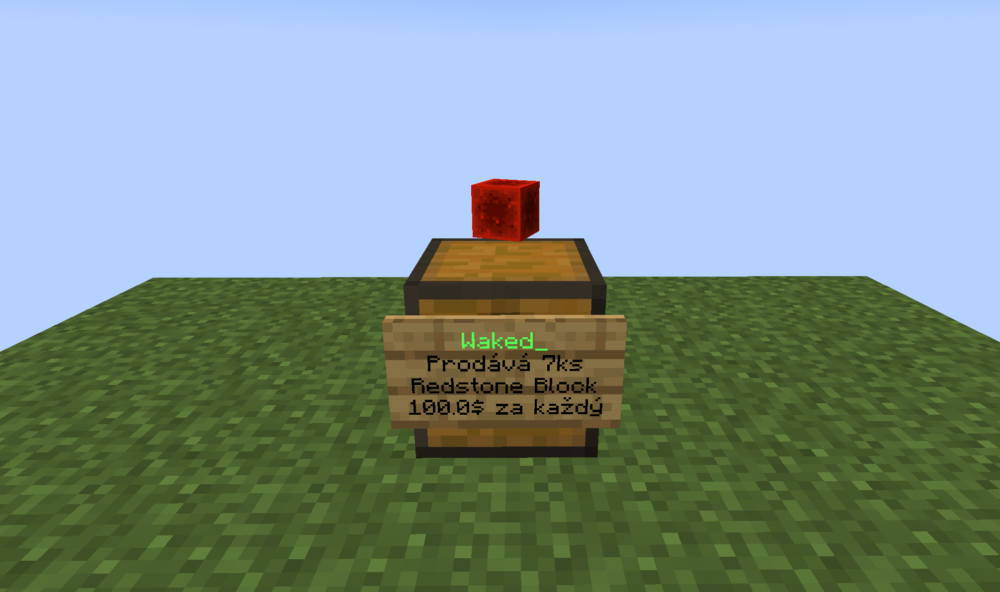
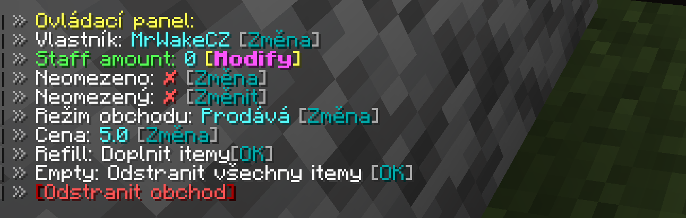

# ChestShop
Zde se dozvíš jak vytvářet a spravovat svůj vlastní shop pomocí truhly.

## Vytvoření prodeje
1. Budeš potřebovat truhlu + item, který chceš prodávat. V našem případě to je Diamond Horse Armor.
2. Zmáčkneš **SHIFT** a poté klikneš **LEVÝM tlačítkem** na myši na truhlu.
3. Poté budeš požádán abys napsal do chatu cenu za 1 kus daného itemu.
4. Shop je vytvořen! Nezapomeň poté doplnit truhlu.

## Vytvoření výkupu
Pokud chceš od hráčů vykupovat itemy, i to chestshop umí. Stačí vytvořit shop, jak je uvedeno výše a poté kliknout
levým tlačítkem na truhlu a zvolit **MOD SHOPU**.

:::note Informace
Shop může vykupovat itemy pouze, pokud má dostatek místa v truhle. Pokud nechceš vykupovat kompletní truhlu, tedy př. 27x64 itemů, vyplň truhlu jinými itemy a tím zablokuješ zbylé sloty.
:::

## Další úpravy
Pravým kliknutím na cedulku shopu můžeš jako majitel upravovat shop. Tedy měnit cenu, majitele, prodej/výkup a jiné.

## Zrušení shopu
Shop lze zníčit třemi jednoduchými způsoby:
- Zníčením truhly
- Pomocí zlaté sekery, když zníčíš cedulku
- Pravým kliknutím na cedulku a volba **smazat shop**
- Koukneš se na cedulku a napíšeš `/qs remove`