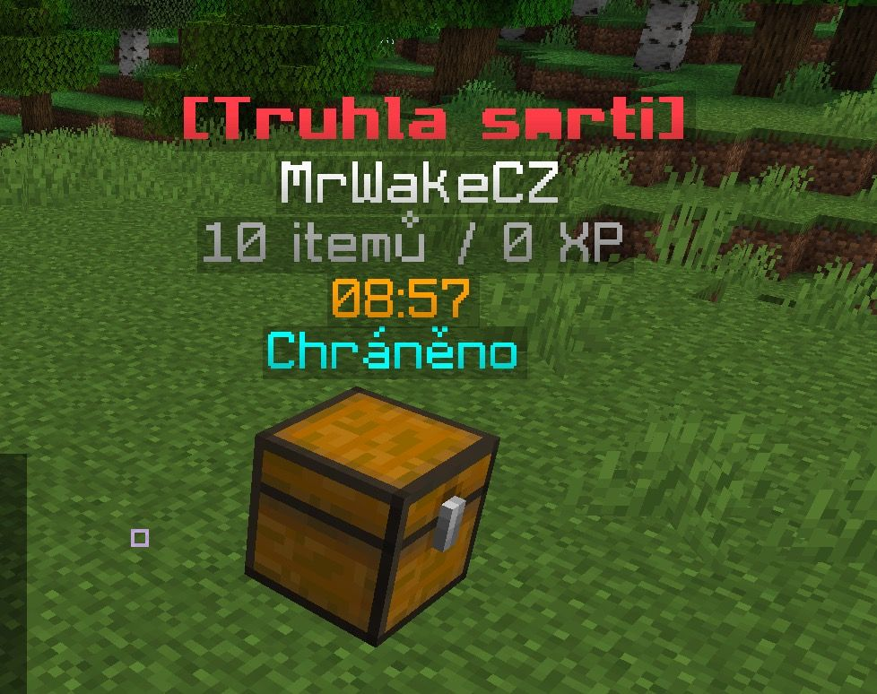

# Truhla smrti
Speciální truhla, která vznikne pouze když hráč zemře na Vanilla severu přináší pár změn a vylepšení k hraní na serveru. K čemu ale slouží?

:::info
Truhla smrti není aktuálně dostupná na žádném serveru.
:::

## Jak funguje?
Pokud se ti někdy stalo, že jsi zemřel(a) tak určitě víš, že někdy itemy se rozlítnou všude, spadnou do voidu, lávy atd. Z tohoto důvodu jsme přidali - Truhlu smrti.
Truhla se vygeneruje po každé smrti a uchová itemy v ní. Zároveň ti truhla oznámí do chatu, kde se nachází.. a pak je tvůj čas. Čas jí získat zpět jinak se zníčí a všechen obsah se rozsype na zem pro všechny ostatní hráče.

:::caution Varování
- Truhly se generují až od Server Levelu 5. Do té doby vždy dropují na zem.
- Pokud máš VIP, truhla je uzamknuta po určitý čas, poté dropnou itemy na zem.
:::

| Rank | Doba truhly | Uzamknutá |
| :----: | :-----: | :-----: |
| Hráč | 3 minuty | Ne |
| Diamond VIP | 6 minut | Ano |
| Emerald VIP | 8 minut | Ano | 
| Obsidian VIP | 10 minut | Ano |
| Amethyst VIP | 10 minut | Ano |

### Dodatečné perky
Díky hraní na serveru si můžeš zpříjemnit svoji smrt (to zní divně). Avšak díky dostatečným levelům a herní době, se ti odemknou lepší možnosti jak se k truhle dostat.

:::info
Všechny výhody zde uvedené si lze odemknout zdarma hraním.
:::

| Perk | Server level | Popis |
| :--- | :----: | :----- |
| Generování truhly | 5 | Truhla se automaticky vytvoří na místě smrti. |
| Dálkové odemknutí | 25 | Víš, že se k truhle nedostaneš? Tak ji můžeš všem odemknout aby jí vybral někdo jiný! |
| Teleport k truhle | 45 | Teleportuj se přímo k truhle (tedy na místo smrti) |
| Fetch | 60 | Teleport je pomalý? Tak si truhlu přetáhni k sobě... |

## Jak truhlu otevřít
- **Pravým kliknutím** - přesuneš veškerý obsah truhly do svého inventáře.
- **Shift + Pravý kliknutí** - otevřeš menu kde si můžeš vybrat jaké itemy chceš.

## Limity
- Počet truhel pro všechny hráče je limitován počtem - **4**
- Pokud limit překročíš, nejstarší truhla se automaticky zníčí.
- Všechny truhly se vždy po vypršení času zníčí a itemy dropnou na zem/voidu/lávy

