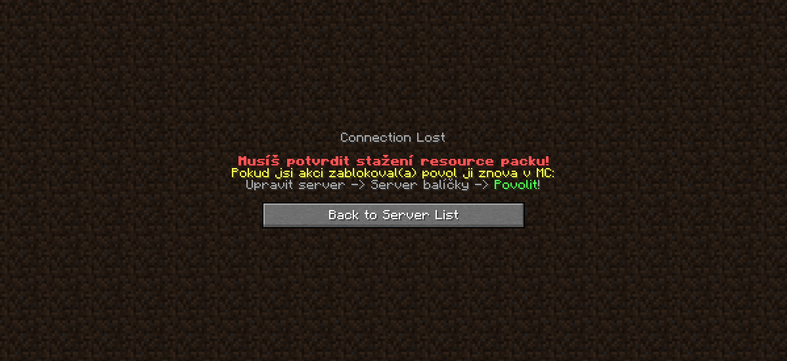

# Problémy s resource packem

Od ledna 2021 jsme zavedli na CraftManii povinné připojení s Resource Packem, někteří hráči ale mohou mít problémy s připojením. Zde proto najdeš nejčastější problémy a řešení, těchto problémů.

## Povolení resource packu
Při prvním připojení na server, se tě Minecraft automaticky zeptá, zda chceš stáhnout a použít náš RP. S tímto musíš souhlasit **jinak se na server nepřipojíš.**

## Server mě vyhazuje s zprávou, že musím povolit RP
V takovém případě stačí **kliknout na server v Minecraftu** (v seznamu serverů) a kliknout na **Upravit**.  Poté by mělo jít připojení už klasicky navždy normálně.

## Resource pack jsem povolil ale i tak mě server kope
V takovém případě musíš provést jednu né-li všechny následující akce:

- **Restartuj** (vypni kompletně) Minecraft, je možné že někde v cache bude uložené, že máš zakázaný resource pack.
- Zkontroluj si zda používáš aspoň verzi 1.16+.
- Pokud používáš Optifine, zkus se připojit na server bez Optifinu, je možné že máš v nastavení něco zakázáno.

## Po připojení mě server vyhodí za timeout
Toto se může stávat hráčům **s pomalým internetem a pomalým počítačem**. V takovém případě nezbývá než se zkusit připojit víc krát. Pokud by se opravdu nešlo připojit, můžeme udělat extra výjimku aby se resource pack nestahoval po připojení.

## Vidím zabugované základní bloky, itemy a jiné věci
Toto se nemůže stát, jelikož náš RP upravuje pouze věci, které hráč nemůže získat a né klasický Minecraft. Zkontroluj si, zda nemáš nastavený svůj jiný Resource Pack.